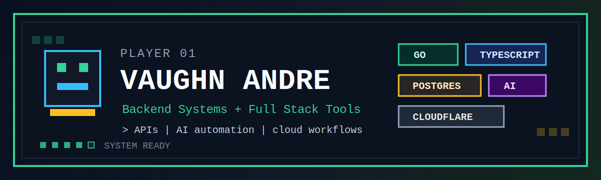

<p align="center">
  
</p>

<h1 align="center">Hi, I'm Vaughn Andre</h1>

<p align="center">
  <strong>Backend-leaning Full Stack Engineer</strong><br />
  Go APIs · TypeScript · AI Automation · Supabase/PostgreSQL · Cloudflare Workers
</p>

<p align="center">
  <a href="https://imvaughn.codes">
    
  </a>
  <a href="https://www.linkedin.com/in/vaughnandrecamangyan">
    
  </a>
  <a href="mailto:vaughnandre.pablo@gmail.com">
    
  </a>
</p>

---

## Start Screen

I build backend systems, automation pipelines, and full stack tools that turn messy workflows into reliable software.

My main loadout is **Go**, **TypeScript**, **PostgreSQL/Supabase**, **Docker**, **Linux**, and **Cloudflare Workers**. I also work with **Next.js** and **React** when the product needs a clean interface on top of the system.

I like simple architecture, practical error handling, readable code, and systems that future developers can extend without needing a walkthrough.

```txt
> player.spawn("Vaughn Andre")
> class.select("Backend-leaning Full Stack Engineer")
> quest.load(["APIs", "AI automation", "cloud workflows", "developer tools"])
> status: shipping
```

---

## Current Quests

```yaml
main:
  role: Backend Engineer at ApexSuite AI
  focus:
    - Go and TypeScript backend services
    - Cloudflare Worker workflows
    - Supabase/PostgreSQL-backed APIs
    - AI-assisted automation pipelines

side_quests:
  - turning ClickUp tasks into structured milestone plans
  - matching job posts against CVs with local AI models
  - building security automation and threat intelligence tooling
```

---

## Skill Tree

| Path | Tools I Use |
| --- | --- |
| **Backend** | Go, Gin, Node.js, Express, REST APIs, microservices |
| **Database** | PostgreSQL, Supabase, SQL design, analytics persistence |
| **Cloud** | Cloudflare Workers, R2, Queues, Durable Objects, KV |
| **Frontend** | Next.js, React, TypeScript, Tailwind CSS |
| **Automation** | Bash, PowerShell, AI workflows, webhooks, system integration |
| **Security** | ClamAV, Wazuh SIEM, MISP, GreyNoise, AlienVault OTX |

---

## Inventory


---

## Boss Fights Shipped

| System | What I Built |
| --- | --- |
| **ApexSuite AI Backend Platform** | Backend microservices and Cloudflare Worker services for logging, feature access checks, content moderation, image optimization, analytics, and social media post history. |
| **ClickUp Task-to-Scaffold Engine** | OpenAI-powered service that converts ClickUp tasks into structured milestone plans, stores results in Supabase, and sends email notifications. |
| **AI Job Matching System** | Go backend that compares job posts against a CV using a local Ollama model, then returns fit scores, decisions, and structured reasoning. |
| **GuardBear Security Automation** | Go backend and automation scripts integrating ClamAV, Wazuh SIEM, MISP, GreyNoise, and AlienVault OTX for security monitoring and response. |

---

## GitHub Stats

<p align="center">
  
  
</p>

<p align="center">
  
</p>

---

## Save Point

I'm open to backend, full stack, automation, and AI integration roles where I can help build practical systems that ship.

```txt
> press_start_to_connect
```

- Portfolio: [imvaughn.codes](https://imvaughn.codes)
- LinkedIn: [linkedin.com/in/vaughnandrecamangyan](https://www.linkedin.com/in/vaughnandrecamangyan)
- GitHub: [github.com/shinichikudo1st](https://github.com/shinichikudo1st)
- Email: [vaughnandre.pablo@gmail.com](mailto:vaughnandre.pablo@gmail.com)
